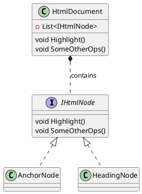
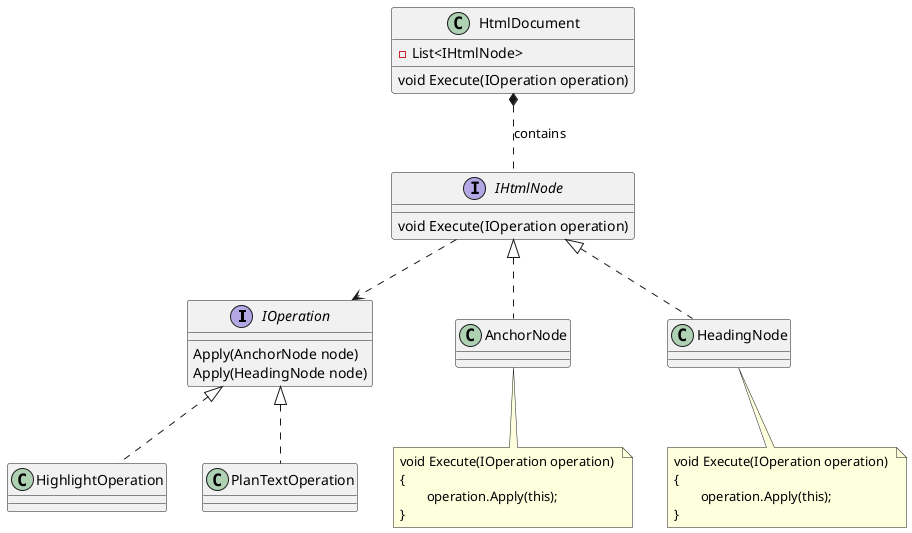


# Problem



The current design involves modifying each implementation of ```IHtmlNode```, whenever we want to add a new operation (method) to this interface. We will also need to add a method in ```HtmlDocument``` too that iterativelys call each ```IHtmlNode``` with the new method accordingly.
This violates the **Open-Close Principle**, as adding new functionality requires modifying the existing classes.

# Solution

Instead of abstracting a variety of possible operations into one ```IHtmlNode``` interface, we abstract on operation itself, and let this ```IOperation``` be explicitly "applicable" to a limited list of ```IHtmlNode```s (via **method overloading**). And for each implementation of ```IHtmlNode```, it simply needs to "execute" on any incoming operations by calling back to the operatation's ```Apply``` method, as long as it satisfies the ```IOperation``` interface. So the change goes to



This new design has at least 2 advantages: 

Firstly, all the implementation of one operation, e.g. highlight, are coded in one place, e.g. ```HighlightOperation```, which contains concrete methods that apply to different concrete types of ```IHtmlNode```. The makes the code perceptually easier to read and maintain. In contrast, the previous design has one operation's logic scattered in the implementation of different ```IHtmlNode```s.

Secondly, this does not violate the **Open-Close Principle**. If tomorrow we want our ```IHtmlNode```s to support a new type of operation, we don't need to modify either the ```IHtmlNode``` interface or its implementations. We simply create (open) a new operation that implements ```IOperation```, and pass it into the ```IHtmlNode```'s ```Execute(IOperation operation)``` method! The ```IHtmlNode``` and its implementations are **closed** for modification!

Caveat: Note this is more feasible as there are only a limited number of ```IHtmlNode```s, and we don't have new types of html node come that often. In contrast, we tend to an unlimited number of possible operations on html nodes, and new operations could appear every now and then.